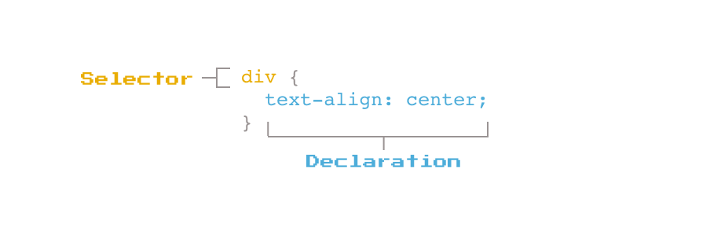

# Practice: Creating a Webpage building upon HTML basics and understanding how to use CSS selectors and properties to bring styling with colors, fonts, sizing, layouts, and much more...

### Practce understanding CSS Syntax

-   [ ] Simple practice to gain a better understanding of the power of adding CSS Styling to a webpage and how it can make it uniquely beautiful
    -   [ ] CSS or Cascading Style Sheet, is a language that paints a website with colors, fonts, layouts, and animations.
    -   [ ] CSS is used to create stunning webpages.
    -   [ ] It can enhance the user experience, and can make a webpage unquie and stand out amongst the rest.
    -   [ ] It is absolutely beautiful to see a webpage come to life and become even more beautiful.

-   [ ] Rules for CSS files are written for how the trageted elements should be styled on a webpage.
-   [ ] Syntax for these rules looks likee this:
    -   [ ] 
-   [ ] Every rule begins with a selector then followed by curly brackets { }.
    -   [ ] Inside the curly brackets, declarations are made of property:value pairs seperated by a colon.
    -   [ ] Each line will end with a semicolon ; .
    -   [ ] CSS files have as many rules as desired. Even most webpages commonly used could have several hundres of CSS rules for it.

---

-   [ ] Encompass:
    -   [ ] HTML
    -   [ ] CSS
-   [ ] HTML:
    -   [ ] Will be the structure and skeleton of how the app will appear on the webpageWill be the structure and skeleton of how the app will appear on the webpage
-   [ ] CSS:
    -   [ ] Encompass the style of the app and give it some flair

